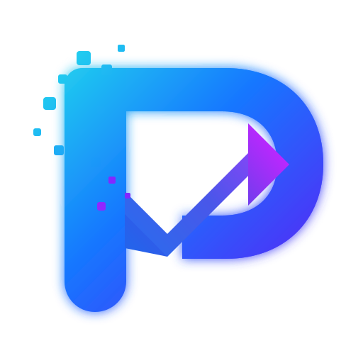

<div align="center">

  

  <h1>⚡ PRODEXA AI ⚡</h1>
  <p><em>Autonomous Neural Operating System for Enterprise Workspaces</em></p>

  <p align="center">
    <a href="https://prodexa-ai-client.vercel.app/"></a>
    <a href="#-system-architecture"></a>
    <a href="#-security--zero-trust-framework"></a>
    <a href="#-license"></a>
  </p>

  <p align="center">
    
  </p>

  <p align="center">
    <strong>Connecting Enterprise Knowledge, Agile Execution, Cognitive Meeting Synthesis, and Deep Code Auditing into a Multi-Agent Intelligence Graph.</strong>
  </p>

  <p align="center">
    <a href="https://prodexa-ai-client.vercel.app/"><strong>[ 🚀 Launch Live Platform ]</strong></a> •
    <a href="#-system-architecture">Architecture</a> •
    <a href="#-autonomous-agent-matrix">Agent Matrix</a> •
    <a href="#-neural-feature-modules">Feature Modules</a> •
    <a href="#-security--zero-trust-framework">Security</a> •
    <a href="#-local-deployment--quickstart">Quickstart</a>
  </p>

</div>

---

## 🛰️ Executive Intelligence Briefing

**Prodexa AI** moves past surface-level chatbot interfaces to deliver an **autonomous work operating layer**. Designed for high-velocity engineering, product, and executive teams, Prodexa embeds multi-model AI routing directly into transactional application state—enabling context-aware collaboration, continuous code auditing, and deterministic human-in-the-loop task execution.

```
       KNOWLEDGE GRAPH                           WORK STREAM
 (Vector Embeddings, Handbooks,             (Sprints, Kanban, PRs,
     Audio Transcriptions)                    AST Code Repos)
               │                                     │
               └──────────────────┬──────────────────┘
                                  ▼
                    PRODEXA AI CONTROL PLANE
       ┌──────────────────────────────────────────────────┐
       │ • Hybrid Vector/Keyword RAG Engine               │
       │ • Multi-Agent Autonomous Orchestrator            │
       │ • Dynamic Model Router (Gemini / Claude / GPT-4)  │
       │ • Semantic Circuit Breaker (<50ms Cache)          │
       └──────────────────────────┬───────────────────────┘
                                  │
               ┌──────────────────┴──────────────────┐
               ▼                                     ▼
     HUMAN-IN-THE-LOOP (HITL)               AUTONOMOUS EXECUTION
  (Approval Inbox & Sandbox Visuals)       (Kanban, Diff Patches, RAG)
```

---

## 🌌 System Paradigm: Traditional vs. Prodexa AI

| Dimension | Legacy AI Interfaces | Prodexa AI Neural OS |
| :--- | :--- | :--- |
| **Context Integration** | Sidecar chat box with detached context | Embedded deeply into Tasks, Code Diffs, Documents, and Live Audio Streams |
| **Retrieval Accuracy** | Unverified generation subject to hallucination | High-precision vector retrieval with source line citations and RAG Confidence Scoring |
| **Conflict Resolution**| Silently merges conflicting documentation | Identifies policy collisions across document versions and highlights authoritative sources |
| **Execution Safety** | Blind autonomous script execution | Pre-action staging sandbox backed by a Human-in-the-Loop (HITL) approval flow |
| **Data Isolation** | Application-layer query filtering | PostgreSQL Engine Row-Level Security (`app.current_tenant_id`) |
| **Audit Durability** | Standard database logs | Immutable SOC 2 Type II HMAC-SHA256 cryptographic hash-chained audit trails |

---

## 🏛️ System Architecture

```
┌────────────────────────────────────────────────────────────────────────────────────────┐
│ FRONTEND LAYER (React 19 • TypeScript • Vite • Tailwind CSS • Framer Motion)            │
│ • Dark Cyberpunk Interface System (#0B0D10 Canvas / #00F0FF Accent / #14171C Cards)    │
│ • Universal Omni Command Palette (Ctrl+K) with AST Indexing                            │
│ • Optimistic State Reconciler with Global State Rollback Toast                         │
│ • Side-by-Side Visual Split Diff Patch Inspector                                       │
└───────────────────────────────────────────┬────────────────────────────────────────────┘
                                            │ HTTPS / WSS / Server-Sent Events (SSE)
                                            ▼
┌────────────────────────────────────────────────────────────────────────────────────────┐
│ BACKEND API CONTROL PLANE (Node.js • Express • TypeScript • BullMQ)                   │
│ • Layer 1: Anti-Tamper & Security Shield (XSS Sanitization, Correlation IDs)           │
│ • Layer 2: Cryptographic JWT & RBAC Middleware Guard                                  │
│ • Dynamic AI Model Router (Google Gemini 1.5 Flash, Anthropic Claude 3.5, OpenAI GPT-4o) │
│ • Sliding-Window Circuit Breaker & Semantic Sub-50ms Response Caching Engine           │
│ • Async Background Task Processors (BullMQ Worker Topologies)                          │
└───────────────────────────────────────────┬────────────────────────────────────────────┘
                                            │ Transactional GUC Database Context
                                            ▼
┌────────────────────────────────────────────────────────────────────────────────────────┐
│ DATABASE & PERSISTENCE LAYER (PostgreSQL • Prisma ORM • pgvector)                     │
│ • Layer 3: Native PostgreSQL Row-Level Security (RLS) Isolation                       │
│ • High-Performance Composite Vector Indices                                            │
│ • SOC 2 Type II Cryptographic Hash-Chained Audit Ledger                                │
└────────────────────────────────────────────────────────────────────────────────────────┘
```

---

## 🤖 Autonomous Agent Matrix

Prodexa AI deploys lightweight specialized agents trained for targeted operational domains:

```
                          ┌───────────────────────────┐
                          │   PRODEXA AGENT ROUTER    │
                          └─────────────┬─────────────┘
                                        │
      ┌──────────────────┬──────────────┴───────────────┬──────────────────┐
      ▼                  ▼                             ▼                  ▼
┌───────────┐      ┌───────────┐                 ┌───────────┐      ┌───────────┐
│  PROJECT  │      │ SECURITY  │                 │   RAG &   │      │  MEETING  │
│  MANAGER  │      │  AUDITOR  │                 │ KNOWLEDGE │      │ SYNTHESIS │
└─────┬─────┘      └─────┬─────┘                 └─────┬─────┘      └─────┬─────┘
      │                  │                             │                  │
      ▼                  ▼                             ▼                  ▼
Deconstructs       Scans AST code                Vectorizes 768-d    Transforms audio
roadmaps into      for vulnerabilities           documents & detects  streams into structured
Kanban tasks.      & auto-patches.               policy collisions.   action items & decisions.
```

- 🎯 **Project Manager Agent**: Evaluates natural language product goals, breaks them into structured task hierarchies, calculates velocity estimates (⏱️), and manages dependency tracking.
- 🛡️ **Security Remediation Agent**: Scans pull requests and repositories for AST anomalies, SQL injections, hardcoded secrets, and memory leaks, generating ready-to-apply patch diffs.
- 📚 **Knowledge & RAG Agent**: Processes unstructured text, PDFs, and handbooks into 768-dimensional vector chunks. Resolves document contradictions by prioritizing updated policy metadata.
- 🎙️ **Meeting Synthesis Agent**: Ingests audio and transcript streams, extracts key decisions, and maps follow-up actions directly into team Kanban lanes.

---

## 📦 Neural Feature Modules

<details open>
<summary><strong>⚡ 1. Control Plane & Daily Briefing</strong></summary>

* **Overnight Workspace Synthesis**: Summarizes recent changes, highlights delivery risks (_e.g., "+12h added to Authentication Core"_), and tracks teammate blockers.
* **HITL Approval Inbox**: Serves as a staging environment where workspace managers can inspect, modify, or reject AI actions before they run against production stores.
</details>

<details open>
<summary><strong>💼 2. Personal Work Center (My Work)</strong></summary>

* **Priority Engine**: Combines assigned tickets, pending pull request reviews, and scheduled calendar events into a single context-aware list.
* **One-Click Recommendations**: Provides context-aware suggestions like reallocating delayed tickets or triggering unit test updates.
</details>

<details>
<summary><strong>📁 3. Knowledge Graph & Vector RAG</strong></summary>

* **Deep Citations**: Connects AI-generated content directly back to exact document sections, complete with retrieval confidence indicators.
* **Conflict Resolution**: Detects overlapping or outdated policy directives (e.g., comparing 2025 vs. 2026 guidelines) and surfaces authoritative source rules.
</details>

<details>
<summary><strong>📋 4. Agile Execution & Dependency Graphs</strong></summary>

* **Natural Language Planning**: Translates high-level prompts (_"Migrate authentication layer to OAuth2"_) into actionable sprint tickets with estimated durations.
* **Interactive Kanban Board**: Manages task lifecycles across drag-and-drop workflow stages (`Backlog`, `In Progress`, `Verification & QA`, `Production Ready`).
</details>

<details>
<summary><strong>💻 5. Code Hub & Split Diff Visualizer</strong></summary>

* **Automated Security Patching**: Displays side-by-side split code diffs comparing vulnerable source code against AI-generated parameterized fixes.
* **Pull Request Checklist Verification**: Validates type safety, test coverage, and security requirements prior to merge.
</details>

<details>
<summary><strong>🎙️ 6. Audio Intelligence & Telemetry</strong></summary>

* **Real-time Meeting Pipeline**: Converts raw audio recordings into executive summaries, key decisions, and actionable tasks.
* **AI ROI Analytics**: Tracks efficiency metrics including hours saved, executed automated actions, and total model compute costs.
</details>

---

## 🔒 Security & Zero-Trust Framework

Prodexa AI uses a three-tier defensive strategy designed to meet enterprise compliance standards:

```
┌────────────────────────────────────────────────────────────────────────┐
│ THREE-TIER ENTERPRISE SECURITY ARCHITECTURE                            │
├────────────────────────────────────────────────────────────────────────┤
│ Layer 1: Edge Security Shield Middleware                               │
│ • Input sanitization, Anti-XSS, and Prototype Pollution defenses       │
│ • Security Response Headers (nosniff, frameguard, strict CSP)          │
├────────────────────────────────────────────────────────────────────────┤
│ Layer 2: Cryptographic JWT & Granular RBAC                             │
│ • HMAC-SHA256 signature verification for session state                 │
│ • Scope-locked route execution guards                                  │
├────────────────────────────────────────────────────────────────────────┤
│ Layer 3: Database Engine Row-Level Security (RLS)                      │
│ • Set parameter via SELECT set_config('app.current_tenant_id', id, true)│
│ • Database-level multi-tenant isolation                                │
└────────────────────────────────────────────────────────────────────────┘
```

* **OWASP LLM Application Security**: Implements mitigation layers against prompt injections (`LLM01`), credential leakage (`LLM02`), and unverified execution paths (`LLM03/LLM06`).
* **Cryptographic Hash-Chained Audit Logs**: Secures system logs using SHA-256 hash chaining, linking each log entry's hash to the preceding payload (`Hash_N = SHA256(Payload_N + Hash_N-1)`).

---

## ⌨️ Global Shortcuts

| Keybinding | Action | Functional Context |
| :--- | :--- | :--- |
| <kbd>Ctrl</kbd> + <kbd>K</kbd> / <kbd>Cmd</kbd> + <kbd>K</kbd> | **Omni Command Palette** | Triggers global semantic search, navigation, and quick action routines |
| <kbd>Esc</kbd> | **Dismiss Overlay** | Closes active drawers, modal dialogs, and floating inspectors |
| <kbd>Enter</kbd> | **Execute Prompt** | Confirms search input or dispatches multi-agent workflow |

---

## 🛠️ Local Deployment & Quickstart

### System Prerequisites
- **Node.js**: `v18.0.0+`
- **PostgreSQL Engine**: `v14.0+` (or an active managed instance on [Supabase](https://supabase.com) / [Neon](https://neon.tech))

---

### Step 1: Source Initialization
```bash
git clone https://github.com/YOUR_USERNAME/prodexa-ai.git
cd prodexa-ai
```

---

### Step 2: Backend Control Plane Configuration
```bash
cd server
npm install

# Initialize environment configuration
cp .env.example .env

# Generate database client & apply migrations
npx prisma generate
npx prisma db push

# Start local server
npm run dev
```

---

### Step 3: Frontend Client Initialization
```bash
cd ../client
npm install

# Start development client
npm run dev
```

---

## 🌐 Production Cloud Deployment

### 1. Backend Service (Render / Railway)
- **Root Directory**: `server`
- **Build Command**: `npm install && npx prisma generate && npm run build`
- **Start Command**: `npm start`
- **Environment Variables**:
  ```env
  DATABASE_URL=postgresql://...
  JWT_SECRET=your_jwt_secret
  GOOGLE_CLIENT_ID=your_id.apps.googleusercontent.com
  GOOGLE_CLIENT_SECRET=your_client_secret
  CLIENT_URL=https://prodexa-ai-client.vercel.app
  ```

---

### 2. Frontend Client (Vercel)
- **Root Directory**: `client`
- **Build Command**: `npm run build`
- **Output Directory**: `dist`
- **Environment Variables**:
  ```env
  VITE_API_URL=https://prodexa-ai-x4v5.onrender.com
  ```

---

## 📄 License

Distributed under the **MIT License**. See `LICENSE` for more information.

---

<div align="center">
  <sub>Built with precision for high-velocity teams. Crafted by the Prodexa AI Engineering Team.</sub>
</div>
